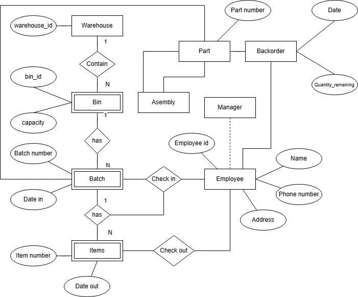

<p>
  
Name: Virak Rith

Student ID: P20230033

Course: RELATIONAL ALGEBRA

Instructor: NOP Phearum

Assignment: TP-2

Due Date: May 26, 2025 (11:59 AM)

</p>
<br/>

# Chapter 12: Warehouse System

## 12.1 Warehouse System Informal Description

```text
Our company has several warehouses, each warehouse is designated by a unique 4-letter
symbol (by a letter we mean a..z and A..Z). Each warehouse has several bins that are
identified uniquely by numbers (unsigned integers), i.e. each warehouse has bins 0, 1, 2,
3,  … Each bin has a particular capacity. In our warehouses (more precisely in the bins in
our warehouses) we store parts. Each part is designated by a unique part number (a 5
symbol sequence of digits and letters). Several parts together can form another part. We
call such a part “assembly”. In the warehouses we store only the constituent parts, but we
record the assemblies in our database as it were a part. Assemblies cannot be parts of
other assemblies. A part can be a constituent part in at most in one assembly parts arrive
in batches. Each batch for a particular part has a unique batch number (unsigned integer)
and arrives on a particular date. Each batch has a size, i.e. the number of items in the
batch. All items from the same batch are stored together in the same bin (no batch is
stored in more than 1 bin). Each item in a batch has a unique item number (unsigned
integer). For example: part A1, batch 27, item 1 or part A1, batch 23, item 1 etc.
When a batch arrives, its date-in is recorded. A particular manager checks its
arrival, and this fact must be recorded in the database.
Some parts may be backordered. A part can be backordered only by a manager.
The manager, the date of the backorder are recorded, and also the quantity backordered.
When a backorder shipment arrives, the backorder’s remaining quantity is updated (the
number of items arrived is subtracted from the remaining quantity), and if it is less or
equal to 0, the backorder is deleted, but must be kept for record. There may be only a
single current (active) backorder for any parts. Assemblies cannot be backordered, only
their constituent parts.
When an item is shipped out of the warehouse, its date-out is recorded together
with the employee who checked its shipping.
Employee has a unique employee number (a 6-digit number), phone number(s) (it
consists of a 3-digit area code and a 6-digit number an employee can have 0 to many
phone numbers), name(s) (it consists of an up=to-10-characters fist name, an up-to-10
characters middle name, and an up-to-20-characters last name, an employee can have 1 to
many names), address(s) (it consists of an up-to-6-characters street number, an up-to-20-characters street name, an up-to-20-characters city name, and a 2-character abbreviation
of the province, an employee can have 1 to many address). Some of the employees are
managers. Every employee who is not a manager works under supervision of a single
manager. Managers do not work under other managers.
```

# Warehouse System UML

Below is the UML class diagram showing the entity and its attribute.



### Partner: Noch Munny Ratanak

## Link to GitHub Account : [Click Here](https://github.com/Poppykhim/ITDB_TP.git) <3

Note: Viewing in VsCode IDE for better formatting!!!
